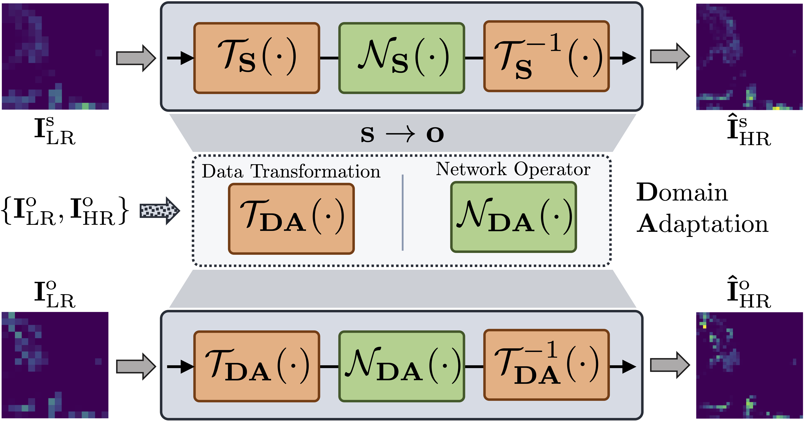
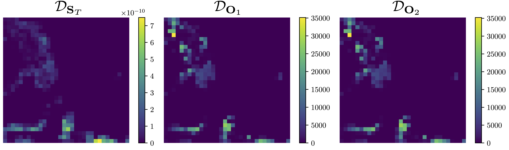
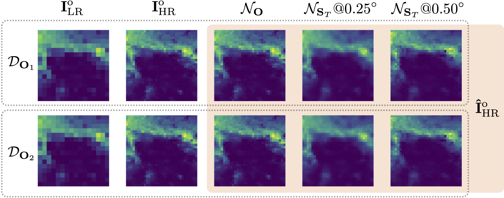
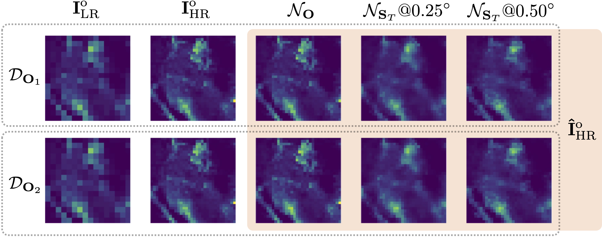
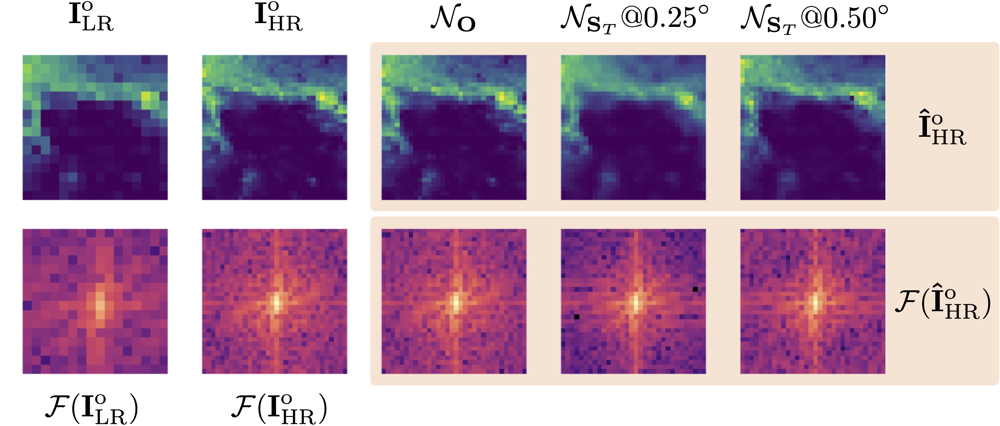
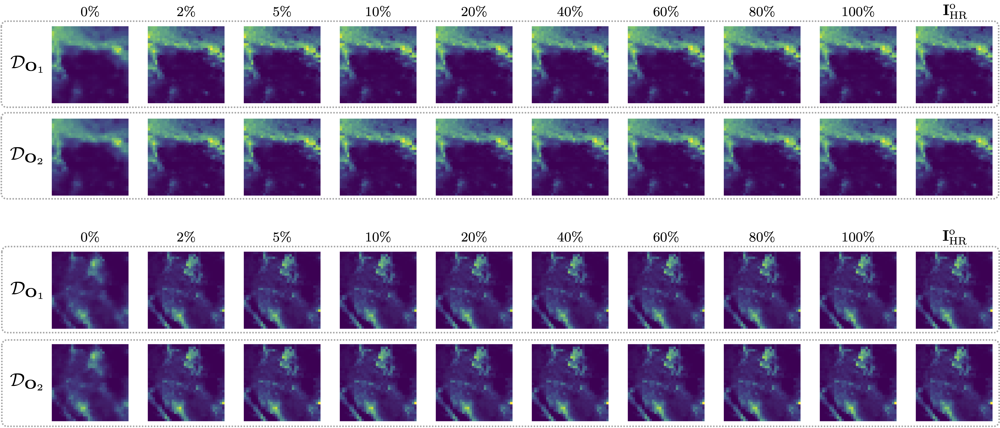
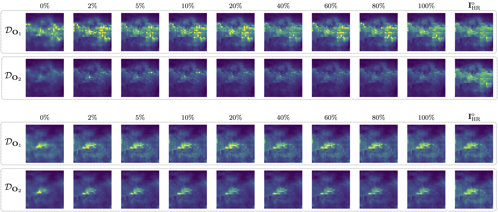
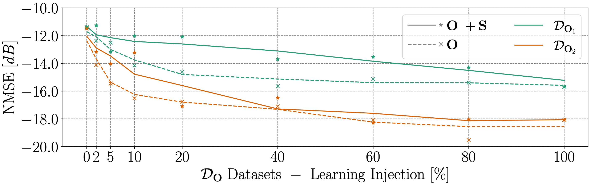
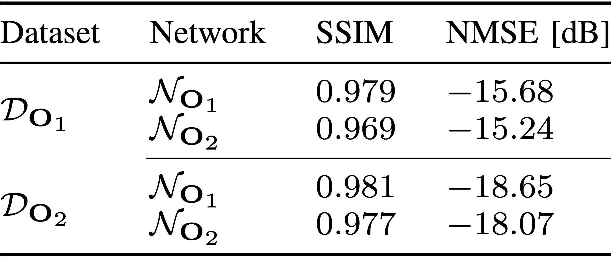

<h1 style="text-align: center;">
Super-Resolution of BVOC Emission Maps Via Domain Adaptation
</h1>

<p align="center" width="100%"></p>

Official Repository of
 **Super-Resolution of BVOC Emission Maps Via Domain Adaptation** paper, accepted at [IGARSS 2023](https://2023.ieeeigarss.org/) and available at [IEEExplore]().
 
## Abstract
[INSERT ABSTRACT HERE]

For more details, please check: "[Super-Resolution of BVOC Emission Maps Via Domain Adaptation](IEEE Link)"

## Supplementary material
### Domain Aggregation Comparison
Comparison between isoprene emission maps corresponding to the same geographical area but to different domains: 
$\mathrm{\mathbf{S}}$(imulated) and $\mathrm{\mathbf{O}}$(observed). 
Emission values and patterns differ according to the data aggregation strategies adopted in each domain.

<p align="center" width="100%"></p>

### Perfect Knowledge Scenario
###### GOME-2 vs OMI Networks Generalization
We also performs a cross inference test between the two networks, fully trained on the two different datasets from $\mathrm{\mathbf{O}}$.
We found that training on $\mathcal{D}\_{\mathrm{\mathbf{O}}\_1}$ and testing on $\mathcal{D}\_{\mathrm{\mathbf{O}}\_2}$ provides comparable result
with the classical case, where we train and test on the same dataset.
This holds also for the $\mathcal{D}\_{\mathrm{\mathbf{O}}\_2}$ dataset.
This happens because the two datasets are very similar, and the network is able to generalize well on both of them.

[//]: # (###### Generalization on Simulated Data)

### Zero Knowledge Scenario
###### Resolution Effect
Visual difference of two emission maps, from different neural networks, for both the $\mathcal{D}\_{\mathrm{\mathbf{O}}\_1}$ and $\mathcal{D}\_{\mathrm{\mathbf{O}}\_1}$ datasets. 
The first and second columns show the low ($\mathrm{\mathbf{I}\_{LR}^{o}}$) and high resolution ($\mathrm{\mathbf{I}\_{HR}^{o}}$) version of the a map from the $\mathrm{\mathbf{O}}$ domain.
The last three columns show the super-resolved maps ($\mathrm{\mathbf{\hat{I}}\_{HR}^{o}}$), obtained by using 3 different network:
- $\mathcal{N}\_{\mathrm{\mathbf{O}}}$ trained on $\mathcal{D}\_{\mathrm{\mathbf{O}}\_1}$ or $\mathcal{D}\_{\mathrm{\mathbf{O}}\_2}$, based on the dataset used for the super-resolution;
- $\mathcal{N}\_{\mathrm{\mathbf{S}}\_T}@0.25^{circ}$ trained on $\mathcal{D}\_{\mathrm{\mathbf{S}}\_T}$ and designed to make a resolution change from $0.50^{\circ}$ to $0.25^{\circ}$ ;
- $\mathcal{N}\_{\mathrm{\mathbf{S}}\_T}@0.50^{circ}$ trained on $\mathcal{D}\_{\mathrm{\mathbf{S}}\_T}$ and designed to make a resolution change from $1.00^{\circ}$ to $0.50^{\circ}$.

Notice that we use the network in a zero-knowledge scenario, thus we do not use any adaptation strategy.

We can observe a substantial difference in the spatial pattern reconstruction between the two networks, trained with data of different spatial resolution.
The $\mathcal{N}\_{\mathrm{\mathbf{S}}\_T}@0.25^{circ}$ provides a more blurred version of the map, but it is able to retrieve the emission values more accurately, as we show in the Sec. 4 of the paper.

[//]: # (Fine-tuning of both the networks should be performed in order to provide more accurate results, since the network trained on the simulated data is not able to capture the satellite-derived emission values.)

<p align="center" width="100%"></p>
<p align="center" width="100%"></p>

[//]: # (###### Spectral Differences)
[//]: # (<p align="center" width="100%"></p>)
[//]: # (### Data Tranformation Adaptation)

### Network Operator Adaptation
###### Injection Comparison
Visual difference of the reconstructed $\mathrm{\mathbf{O}}$ emission, obtained using different fine-tuned version of $\mathcal{N}\_{\mathrm{\mathbf{S}}\_T}$ network.
The percentages denote the amount of data from $\mathcal{D}\_{\mathrm{\mathbf{O}}\_1}$ or $\mathcal{D}\_{\mathrm{\mathbf{O}}\_2}$ injected in the learning procedure (train and validation).
We found that most of the time we obtain acceptable results by injecting just a small amount of data from $\mathcal{D}\_{\mathrm{\mathbf{O}}\_1}$ or $\mathcal{D}\_{\mathrm{\mathbf{O}}\_2}$ 
in the learning procedure, as we can notice from the emission patches.  

<p align="center" width="100%"></p>

For a few particular emission patches, we found that the network is not able to learn the correct mapping between the two domains, leading to unreliable results .
We believe that this behavior is due to the original small dynamic of the $\mathrm{\mathbf{O}}$ patch to be enhanced.
<p align="center" width="100%"></p>

###### Performance Comparison
Average NMSE achieved by the Network Operator adaptation strategy, in which we train the neural network by varying the amount of injected patches from the $\mathrm{\mathbf{O}}$ domain.
The solid line represents the trend when we use mixed patches from both domains, i.e., $\mathrm{\mathbf{O}}$ and $\mathrm{\mathbf{S}}$, in the validation phase.
The dashed line represents the trend when we use only patches from the $\mathrm{\mathbf{O}}$ domain in the validation phase.

<p align="center" width="100%"></p>

We can observe a more stable trend when we validate on mixed patches from both domains, 
but validating only with patches from the $\mathrm{\mathbf{O}}$ domain seems to provide better results with less injected patches. 
This also reduces the amount time needed to perform the full training and reach convergence.


<p align="center" width="100%"></p.

## Citation
```BibTex
@article{giganti2023bvoc-da,
      title={Super-Resolution of BVOC Emission Maps Via Domain Adaptation}, 
      author={Antonio Giganti, Sara Mandelli, Paolo Bestagini, Marco Marcon, Stefano Tubaro},
      year={2023},
      DA COMPLETARE
}
```

## Related Works on BVOC
A. Giganti, S. Mandelli, P. Bestagini, et al., “Super-resolution of
bvoc maps by adapting deep learning methods,” arXiv preprint, 2023

[](https://arxiv.org/abs/2302.07570v2)

A. Giganti, S. Mandelli, P. Bestagini, et al., “Multi-BVOC Super-Resolution Exploiting Compounds Inter-Connection,” arXiv preprint, 2023

[](https://arxiv.org/abs/2305.14180v1)

### Acknowledgement
This work was supported by the Italian Ministry of University and
Research (MUR) and the European Union (EU) under the PON/REACT project.

</img>
</img>
</img>
</img>
</img>


