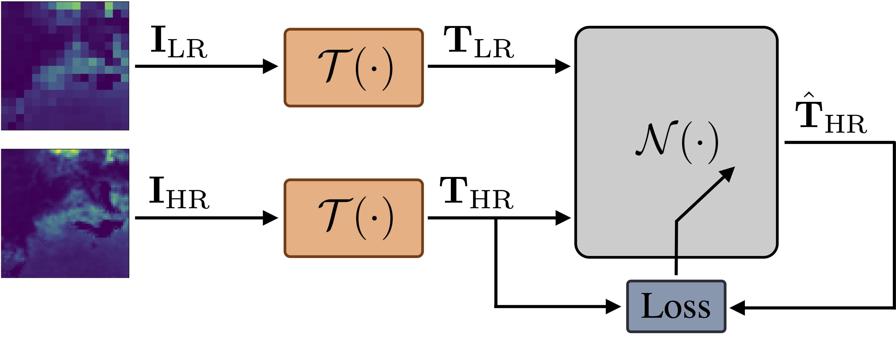
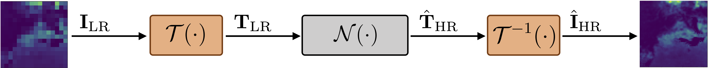
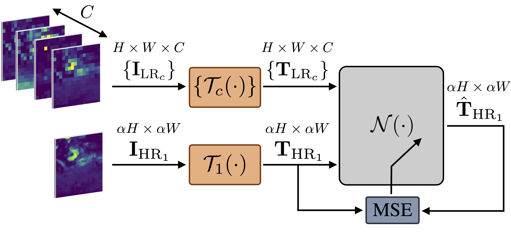
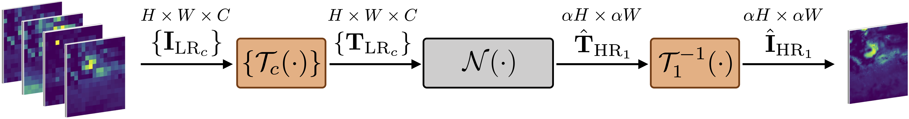
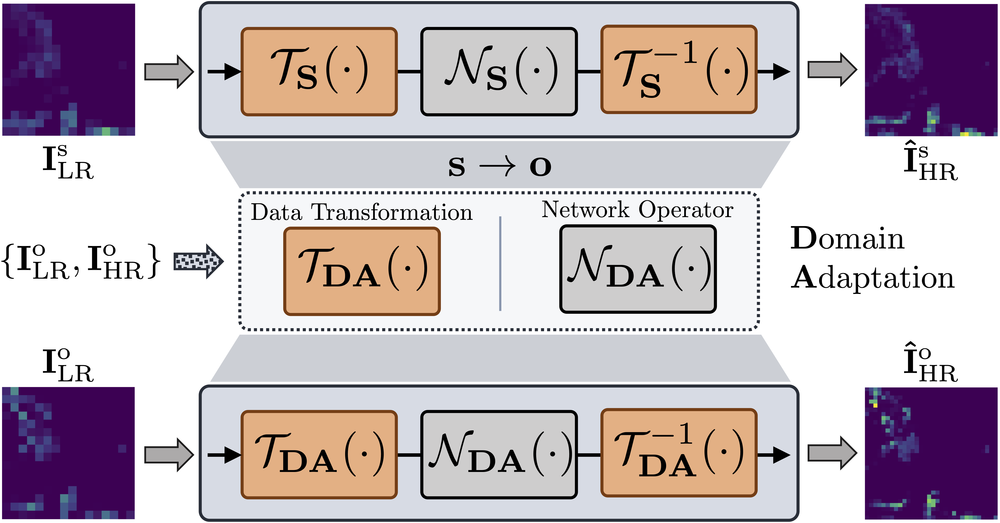

# :globe_with_meridians: :earth_africa: :seedling: Super-Resolution of BVOC Emissions :seedling: :earth_africa: :globe_with_meridians:

This repository is meant to represent a comprehensive collection of all the research works conducted by the Image and Sound Processing Lab 
([ISPL](http://ispl.deib.polimi.it/)) research group at [Politecnico di Milano](https://www.polimi.it/en), and focused on the super-resolving 
Biogenic Volatile Organic Compound ([BVOC](https://www.cnr.it/en/focus/046-4/bvoc-biogenic-volatile-organic-compound-emission-responses-to-climate-change)) 
emission maps using novel Deep Learning (DL) techniques. 

BVOC emissions play a crucial role in understanding the interactions between vegetation and the atmosphere, 
particularly in the context of climate change and air quality assessment. The application of deep learning methods for 
super-resolving BVOC emission maps has proven to be a promising approach to enhance the spatial resolution and improve the accuracy of these maps.

The works available in this repository are listed below:

1. :link: [Super-Resolution of BVOC Maps by Adapting Deep Learning Methods](#super-resolution-of-bvoc-maps-by-adapting-deep-learning-methods), [IEEE-ICIP 2023](https://2023.ieeeicip.org/)
   
[](https://ieeexplore.ieee.org/document/10223169)
[](https://arxiv.org/abs/2302.07570)

2. :link: [Multi-BVOC Super-Resolution Exploiting Compounds Inter-Connection](#multi-bvoc-super-resolution-exploiting-compounds-inter-connection), [EURASIP-EUSIPCO 2023](https://eusipco2023.org/)
   
[](https://ieeexplore.ieee.org/document/10290089)
[](https://arxiv.org/abs/2305.14180)

3. :link: [Super-Resolution of BVOC Emission Maps Via Domain Adaptation](#super-resolution-of-bvoc-emission-maps-via-domain-adaptation), [IEEE-IGARSS 2023](https://2023.ieeeigarss.org/)

[](https://ieeexplore.ieee.org/document/10281779)
[](https://arxiv.org/abs/2306.12796)

4. :link: [Learn from Simulations, Adapt to Observations: Super-Resolution of Isoprene Emissions via Unpaired Domain-Adaptation](#learn-from-imulations-adapt-to-observations-super-resolution-of-isoprene-emissions-via-unpaired-domain-adaptation), [MDPI Remote Sensing 2024](https://www.mdpi.com/journal/remotesensing)
   
[](https://www.mdpi.com/2072-4292/16/21/3963) - [CODE](https://github.com/polimi-ispl/sr-da-bvoc) 

5. :link: [Leveraging Land Cover Priors for Isoprene Emission Super-Resolution](#leveraging-land-cover-priors-for-isoprene-emission-super-resolution), [MDPI Remote Sensing 2024](https://www.mdpi.com/2072-4292/17/10/1715)
   
[](https://www.mdpi.com/2072-4292/16/21/3963) - [CODE](https://github.com/polimi-ispl/sr-bvoc-lc) 


--- 

# 1) :herb: Super-Resolution of BVOC Maps by Adapting Deep Learning Methods

### Train
<p align="center" width="100%"></p>

### Deployment
<p align="center" width="100%"></p>

## Abstract

Biogenic Volatile Organic Compounds (BVOCs) play a critical role in biosphere-atmosphere interactions, being a key factor in the physical and chemical properties 
of the atmosphere and climate. Acquiring large and fine-grained BVOC emission maps is expensive and time-consuming, so most available BVOC data are obtained on a 
loose and sparse sampling grid or on small regions. However, high-resolution BVOC data are desirable in many applications, such as air quality, atmospheric chemistry, 
and climate monitoring. In this work, we investigate the possibility of enhancing BVOC acquisitions, further explaining the relationships between the environment 
and these compounds. We do so by comparing the performances of several state-of-the-art neural networks proposed for image Super-Resolution (SR), adapting them to 
overcome the challenges posed by the large dynamic range of the emission and reduce the impact of outliers in the prediction. Moreover, we also consider realistic 
scenarios, considering both temporal and geographical constraints. Finally, we present possible future developments regarding SR generalization, considering the 
scale-invariance property and super-resolving emissions from unseen compounds.

For more details, please check the full paper here: "[Super-Resolution of BVOC Maps by Adapting Deep Learning Methods](https://arxiv.org/abs/2302.07570)"

## Citation
```BibTeX
@INPROCEEDINGS{giganti-bvoc-sr-2023,
  author={Giganti, Antonio and Mandelli, Sara and Bestagini, Paolo and Marcon, Marco and Tubaro, Stefano},
  booktitle={2023 IEEE International Conference on Image Processing (ICIP)}, 
  title={Super-Resolution of BVOC Maps by Adapting Deep Learning Methods}, 
  year={2023},
  volume={},
  number={},
  pages={1650-1654},
  doi={10.1109/ICIP49359.2023.10223169}}
```

---

# 2) :herb: Multi-BVOC Super-Resolution Exploiting Compounds Inter-Connection

### Train
<p align="center" width="100%"></p>

### Deployment
<p align="center" width="100%"></p>

## Abstract

Biogenic Volatile Organic Compounds (BVOCs) emitted from the terrestrial ecosystem into the Earth's atmosphere are an important component of atmospheric chemistry. 
Due to the scarcity of measurement, a reliable enhancement of BVOCs emission maps can aid in providing denser data for atmospheric chemical, climate, 
and air quality models. In this work, we propose a strategy to super-resolve coarse BVOC emission maps by simultaneously exploiting the contributions of different compounds. 
To this purpose, we first accurately investigate the spatial inter-connections between several BVOC species. 
Then, we exploit the found similarities to build a Multi-Image Super-Resolution (MISR) system, in which a number of emission maps associated with diverse 
compounds are aggregated to boost Super-Resolution (SR) performance. We compare different configurations regarding the species and the number of joined BVOCs. 
Our experimental results show that incorporating BVOCs' relationship into the process can substantially improve the accuracy of the super-resolved maps. 
Interestingly, the best results are achieved when we aggregate the emission maps of strongly uncorrelated compounds. This peculiarity seems to confirm what was 
already guessed for other data-domains, i.e., joined uncorrelated information are more helpful than correlated ones to boost MISR performance. Nonetheless, 
the proposed work represents the first attempt in SR of BVOC emissions through the fusion of multiple different compounds.

For more details, please check the full paper here: "[Multi-BVOC Super-Resolution Exploiting Compounds Inter-Connection](https://arxiv.org/abs/2305.14180)"

## Citation

```BibTeX
@INPROCEEDINGS{giganti-bvoc-misr-2023,
  author={Giganti, Antonio and Mandelli, Sara and Bestagini, Paolo and Marcon, Marco and Tubaro, Stefano},
  booktitle={2023 31st European Signal Processing Conference (EUSIPCO)}, 
  title={Multi-BVOC Super-Resolution Exploiting Compounds Inter-Connection}, 
  year={2023},
  volume={},
  number={},
  pages={1315-1319},
  doi={10.23919/EUSIPCO58844.2023.10290089}}
```


---

# 3) :herb: Super-Resolution of BVOC Emission Maps Via Domain Adaptation

<p align="center" width="100%"></p>
 
## Abstract
Enhancing the resolution of Biogenic Volatile Organic Compound (BVOC) emission maps is a critical task in remote sensing. 
Recently, some Super-Resolution (SR) methods based on Deep Learning (DL) have been proposed, leveraging data from numerical simulations for their training process. 
However, when dealing with data derived from satellite observations, the reconstruction is particularly challenging 
due to the scarcity of measurements to train SR algorithms with. 
In our work, we aim at super-resolving low resolution emission maps derived from satellite observations 
by leveraging the information of emission maps obtained through numerical simulations. 
To do this, we combine a SR method based on DL with Domain Adaptation (DA) techniques, 
harmonizing the different aggregation strategies and spatial information used in simulated and observed domains to ensure compatibility. 
We investigate the effectiveness of DA strategies at different stages by systematically varying the number of simulated and observed emissions used, 
exploring the implications of data scarcity on the adaptation strategies. To the best of our knowledge, 
there are no prior investigations of DA in satellite-derived BVOC maps enhancement. 
Our work represents a first step toward the development of robust strategies for the reconstruction of observed BVOC emissions.

For more details, please check the full paper here: "[Super-Resolution of BVOC Emission Maps Via Domain Adaptation](https://arxiv.org/abs/2306.12796)"


<p align="center" width="100%"></p>


<p align="center" width="100%"></p>


## Citation
```BibTex
@INPROCEEDINGS{giganti-bvoc-adaptation-2023,
  author={Giganti, Antonio and Mandelli, Sara and Bestagini, Paolo and Marcon, Marco and Tubaro, Stefano},
  booktitle={IGARSS 2023 - 2023 IEEE International Geoscience and Remote Sensing Symposium}, 
  title={Super-Resolution of Bvoc Emission Maps Via Domain Adaptation}, 
  year={2023},
  volume={},
  number={},
  pages={738-741},
  doi={10.1109/IGARSS52108.2023.10281779}}
```

---

# 4) :herb: Learn from Simulations, Adapt to Observations: Super-Resolution of Isoprene Emissions via Unpaired Domain-Adaptation
 
## Abstract
Plants emit Biogenic Volatile Organic Compounds (BVOCs), such as isoprene, significantly influencing atmospheric chemistry and climate. BVOC emissions estimated from bottom-up (BU) approaches (derived from numerical simulations) usually exhibit denser and more detailed spatial information concerning the ones estimated through top-down (TD) approaches (derived from satellite observations). Moreover, numerically simulated emissions are typically easier to obtain, even if they are less reliable than satellite acquisitions which, being derived from actual measurements, are considered a more trustworthy instrument to perform chemistry and climate investigations. Given the coarseness and relative lack of satellite-derived measurements, fine-grained numerically simulated emissions could be exploited to enhance them. However, simulated (BU) and observed (TD) emissions usually differ regarding value range and spatiotemporal resolution. In this work, we present a novel Deep Learning (DL)-based approach to increase the spatial resolution of satellite-derived isoprene emissions, investigating the adoption of efficient Domain Adaptation (DA) techniques to bridge the gap between numerically simulated emissions and satellite-derived ones, avoiding the need of retraining a specific Super-Resolution (SR) algorithm on them. To do so, we propose a methodology based on the Cycle Generative Adversarial Network (CycleGAN) architecture, which has been extensively used for adapting natural images (like digital photographs) of different domains. In our work, we depart from the standard CycleGAN framework, proposing additional loss terms that allow for better DA and emissions’ SR. We extensively demonstrate the proposed method’s effectiveness and robustness in restoring fine-grained patterns of observed isoprene emissions. Moreover, we compare different setups and validate our approach using different emission inventories from both domains. Eventually, we show that the proposed DA strategy paves the way towards robust SR solutions even in case of spatial resolution mismatch between the training and testing domains and in case of unknown testing data.

For more details, please check the full paper here: "[Learn from Simulations, Adapt to Observations: Super-Resolution of Isoprene Emissions via Unpaired Domain Adaptation](https://www.mdpi.com/2072-4292/16/21/3963)" 

:arrow_right: :arrow_right::computer: [IMPLEMENTATION CODE](https://github.com/polimi-ispl/sr-da-bvoc) 
 :computer: :arrow_left: :arrow_left:

 


 
## Citation
```Bibtex
@ARTICLE{giganti2024bvoc,
author = {Giganti, Antonio and Mandelli, Sara and Bestagini, Paolo and Tubaro, Stefano},
title = {Learn from Simulations, Adapt to Observations: Super-Resolution of Isoprene Emissions via Unpaired Domain Adaptation},
journal = {Remote Sensing},
volume = {16},
year = {2024},
number = {21},
doi = {10.3390/rs16213963}
}
```

---

# 5) :herb: Leveraging Land Cover Priors for Isoprene Emission Super-Resolution
 
## Abstract
Satellite remote sensing plays a crucial role in monitoring Earth’s ecosystems, yet satellite-derived data often suffer from limited spatial resolution, restricting the availability of accurate and precise data for atmospheric modeling and climate research. Errors and biases may also be introduced into applications due to the use of data with insufficient spatial and temporal resolution. In this work, we propose a deep learning-based Super-Resolution (SR) framework that leverages land cover information to enhance the spatial accuracy of Biogenic Volatile Organic Compound (BVOC) emissions, with a particular focus on isoprene. Our approach integrates land cover priors as emission drivers, capturing spatial patterns more effectively than traditional methods. We evaluate the model’s performance across various climate conditions and analyze statistical correlations between isoprene emissions and key environmental information such as cropland and tree cover data. Additionally, we assess the generalization capabilities of our SR model by applying it to unseen climate zones and geographical regions. Experimental results demonstrate that incorporating land cover data significantly improves emission SR accuracy, particularly in heterogeneous landscapes. This study contributes to atmospheric chemistry and climate modeling by providing a cost-effective, data-driven approach to refining BVOC emission maps. The proposed method enhances the usability of satellite-based emissions data, supporting applications in air quality forecasting, climate impact assessments, and environmental studies.

For more details, please check the full paper here: "[Leveraging Land Cover Priors for Isoprene Emission Super-Resolution](https://www.mdpi.com/2072-4292/17/10/1715)" 

:arrow_right: :arrow_right::computer: [IMPLEMENTATION CODE](https://github.com/polimi-ispl/sr-bvoc-lc) 
 :computer: :arrow_left: :arrow_left:

 


 
## Citation
```Bibtex
@article{ummerle2025srbvoclc,
AUTHOR = {Ummerle, Christopher and Giganti, Antonio and Mandelli, Sara and Bestagini, Paolo and Tubaro, Stefano},
TITLE = {Leveraging Land Cover Priors for Isoprene Emission Super-Resolution},
JOURNAL = {Remote Sensing},
VOLUME = {17},
YEAR = {2025},
NUMBER = {10},
ARTICLE-NUMBER = {1715},
URL = {https://www.mdpi.com/2072-4292/17/10/1715},
ISSN = {2072-4292},
DOI = {10.3390/rs17101715}
}
```
---

## :open_file_folder: BVOC Inventories
The simulated data [MEGAN](https://bai.ess.uci.edu/megan) and satellite-derived used in these works are available from the following links:

**Bottom-up** inventories:
- [MEGANv2.1](https://permalink.aeris-data.fr/CAMS-GLOB-BIO)
distributed by Emissions of atmospheric Compounds and Compilation of Ancillary Data ([ECCAD](https://eccad.aeris-data.fr/)), Global Emissions InitiAtive ([GEIA](https://www.geiacenter.org/))
- [MEGANv3.2](https://doi.org/10.57760/sciencedb.iap.00008)

</img>
</img>
</img>
</img>

**Top-down** inventories:
- [GOME-2](https://emissions.aeronomie.be/index.php/gome2-based)
- [OMI](https://emissions.aeronomie.be/index.php/omi-based)
- [TROPOMI](https://www.seedsproject.eu/data)

distributed by the Belgian Institute for Space Aeronomy ([BIRA-IASB](https://www.aeronomie.be/))

</img>
</img>
</img>
</img>

---
## :mag: Useful Links & Articles

**Relevant Articles**
- N. Rampal et al., (2024). _Enhancing Regional Climate Downscaling through Advances in Machine Learning_, [article](https://journals.ametsoc.org/view/journals/aies/3/2/AIES-D-23-0066.1.xml)
- Wang, H., et al., (2024). _Regional to global distributions, trends, and drivers of biogenic volatile organic compound emission from 2001 to 2020_, [article](https://acp.copernicus.org/articles/24/3309/2024/)
- G.-M. Oomen et al., (2024). _Weekly derived top-down volatile-organic-compound fluxes over Europe from TROPOMI HCHO data from 2018 to 2021_, [article](https://acp.copernicus.org/articles/24/449/2024/)
- Opacka, B., et al., (2021). _Global and regional impacts of land cover changes on isoprene emissions derived from spaceborne data and the MEGAN model_, [article](https://acp.copernicus.org/articles/21/8413/2021/)
- Wang, H., et al., (2021). _A long-term estimation of biogenic volatile organic compound (BVOC) emission in China from 2001–2016: the roles of land cover change and climate variability_, [article](https://acp.copernicus.org/articles/21/4825/2021/)

**Overview**
-  Cai, M., et al., (2021). _A scientometric analysis and review of biogenic volatile organic compound emissions: Research hotspots, new frontiers, and environmental implications_, [article](https://www.sciencedirect.com/science/article/abs/pii/S1364032121006043)
- Niinemets, Ü, et al., (2013). _Biology, Controls and Models of Tree Volatile Organic Compound Emissions_, [book](https://link.springer.com/book/10.1007/978-94-007-6606-8)
-  Peñuelas, J. and Staudt, M. (2010). _BVOCs and global change_, [article](https://www.sciencedirect.com/science/article/abs/pii/S1360138509003197)
- Laothawornkitkul, J., et al. (2009). _Biogenic volatile organic compounds in the Earth system_, [article](https://nph.onlinelibrary.wiley.com/doi/10.1111/j.1469-8137.2009.02859.x)
- Tani, A., et al., (2021). _Review: Exchanges of volatile organic compounds between terrestrial ecosystems and the atmosphere_, [article](https://www.jstage.jst.go.jp/article/agrmet/77/1/77_D-20-00025/_article)
- Yang, K., et al., (2024). _Exchange of volatile organic compounds between the atmosphere and the soil_, [article](https://link.springer.com/article/10.1007/s11104-024-06524-x)

**Inventories**
-  [2024] BVOC 2001-2020 MEGAN v3.2 [article](https://acp.copernicus.org/articles/24/3309/2024/), [data](https://www.scidb.cn/en/detail?dataSetId=f1cdb0cfbd70410d88f491a75844912b)
-  [2020] Isoprene 2013 CrIS [article](https://www.nature.com/articles/s41586-020-2664-3), [data](https://conservancy.umn.edu/items/431b1ffe-f7ac-4596-915b-b178475bca4f)
-  [SEEDS project](https://www.seedsproject.eu/), [data](https://www.seedsproject.eu/data)
-  [CEOS Database](https://database.eohandbook.com/data/dataactivity.aspx), [CEOS Measurement](https://database.eohandbook.com/measurements/overview.aspx)
-  [ECCAD](https://eccad.aeris-data.fr/)
-  [BIRA-IASB](https://www.aeronomie.be/), [data 1](https://emissions.aeronomie.be/), [data 2](https://repository.aeronomie.be/repository.php)
-  [NASA EarthData](https://www.earthdata.nasa.gov/learn/pathfinders/air-quality-data-pathfinder/find-data#trace-gas-data) Trace Gas
-  [Various](https://github.com/satellite-image-deep-learning/datasets?tab=readme-ov-file)

**Related Projects**
-  [VEG-GAP project](https://www.lifeveggap.eu/), [platform](https://veggaplatform.enea.it/)
-  [ALBERI project](https://alberi.aeronomie.be/index.php)
-  [WEKEO by Copernicus](https://www.wekeo.eu/), [data portal](https://www.wekeo.eu/data)
-  [NASA PACE](https://pace.gsfc.nasa.gov/), [data portal](https://pace.oceansciences.org/access_pace_data.htm)
-  [Sentinel Hub](https://www.sentinel-hub.com/), [data portal](https://apps.sentinel-hub.com/eo-browser/)
-  [Microsoft Planetary Computer](https://planetarycomputer.microsoft.com/), [catalog](https://planetarycomputer.microsoft.com/catalog)
-  [OSGeo Fundation](https://www.osgeo.org/)
-  [TorchGeo](https://github.com/microsoft/torchgeo)
-  [CAMS Emission general document](https://atmosphere.copernicus.eu/sites/default/files/2019-06/cams_emissions_general_document_apr2019_v7.pdf)
-  [NASA EarthData](https://appliedsciences.nasa.gov/get-involved/training/english/arset-high-resolution-no2-monitoring-space-tropomi) train material (NO2 from TROPOMI) 

---

## :busts_in_silhouette: About Us
- Image and Sound Processing Lab ([ISPL](http://ispl.deib.polimi.it/))
- Department of Electronics, Information and Bioengineering ([DEIB](https://www.deib.polimi.it/eng/home-page))
- [Politecnico di Milano](https://www.polimi.it/en)

- Antonio Giganti, [ResearchGate](https://www.researchgate.net/profile/Antonio-Giganti), [LinkedIn](https://www.linkedin.com/in/antoniogiganti/)
- Sara Mandelli, [ResearchGate](https://www.researchgate.net/profile/Sara-Mandelli), [LinkedIn](https://www.linkedin.com/in/saramandelli/)
- Paolo Bestagini, [LinkedIn](https://www.linkedin.com/in/paolo-bestagini-390b461b4/)
- Marco Marcon, [LinkedIn](https://www.linkedin.com/in/marco-marcon-26140b13/)
- Stefano Tubaro, [ResearchGate](https://www.researchgate.net/profile/Stefano-Tubaro), [LinkedIn](https://www.linkedin.com/in/stefano-tubaro-73aa9916/)


### Acknowledgement
These works were supported by the Italian Ministry of University and
Research [MUR](https://www.mur.gov.it/it) and the European Union (EU) under the [PON/REACT](https://www.ponic.gov.it/sites/PON/ReactEU) project.

</img>
</img>
</img>
</img>
</img>


## :page_with_curl: Poster - GTTI Rome 2023 
<p align="center" width="100%"></p>

