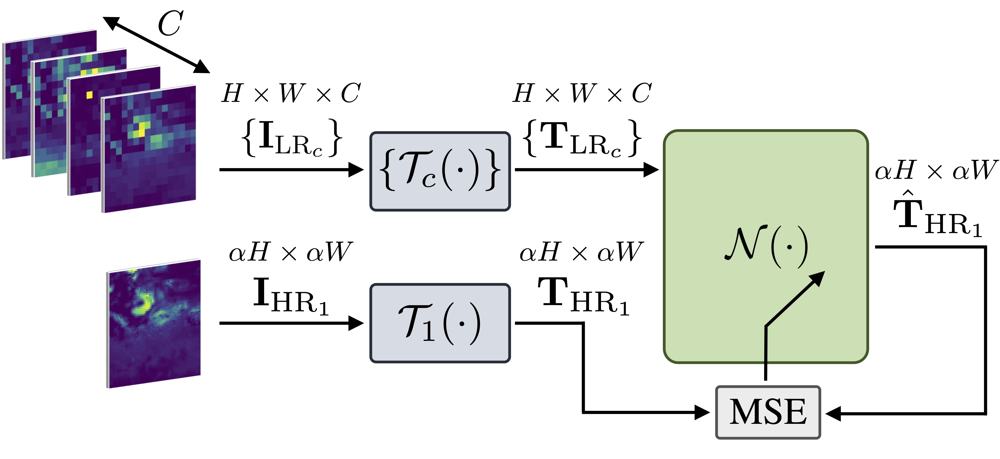
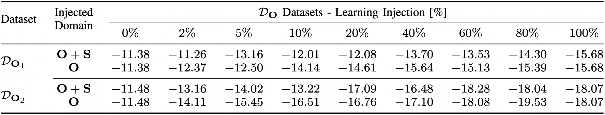

# :globe_with_meridians: :earth_africa: :seedling: Super-Resolution of BVOC Emissions :seedling: :earth_africa: :globe_with_meridians:

This repository is meant to represent a comprehensive collection of all the research works conducted by the Image and Sound Processing Lab 
([ISPL](http://ispl.deib.polimi.it/)) research group at [Politecnico di Milano](https://www.polimi.it/en), and focused on the super-resolving 
Biogenic Volatile Organic Compound ([BVOC](https://www.cnr.it/en/focus/046-4/bvoc-biogenic-volatile-organic-compound-emission-responses-to-climate-change)) 
emission maps using novel Deep Learning (DL) techniques. 

BVOC emissions play a crucial role in understanding the interactions between vegetation and the atmosphere, 
particularly in the context of climate change and air quality assessment. The application of deep learning methods for 
super-resolving BVOC emission maps has proven to be a promising approach to enhance the spatial resolution and improve the accuracy of these maps.

The works available in this repository are listed below:

1. :link: [Super-Resolution of BVOC Maps by Adapting Deep Learning Methods](#super-resolution-of-bvoc-maps-by-adapting-deep-learning-methods), (2023) - [IEEE-ICIP 2023](https://2023.ieeeicip.org/)
   
[](https://ieeexplore.ieee.org/document/10223169)
[](https://arxiv.org/abs/2302.07570)

2. :link: [Multi-BVOC Super-Resolution Exploiting Compounds Inter-Connection](#multi-bvoc-super-resolution-exploiting-compounds-inter-connection), (2023) - [EURASIP-EUSIPCO 2023](https://eusipco2023.org/)
   
[](https://ieeexplore.ieee.org/document/10290089)
[](https://arxiv.org/abs/2305.14180)

3. :link: [Super-Resolution of BVOC Emission Maps Via Domain Adaptation](#super-resolution-of-bvoc-emission-maps-via-domain-adaptation), (2023) - [IEEE-IGARSS 2023](https://2023.ieeeigarss.org/)

[](https://ieeexplore.ieee.org/document/10281779)
[](https://arxiv.org/abs/2306.12796)

--- 

# 1) :herb: Super-Resolution of BVOC Maps by Adapting Deep Learning Methods

### Train
<p align="center" width="100%"></p>

### Deployment
<p align="center" width="100%"></p>

## Abstract

Biogenic Volatile Organic Compounds (BVOCs) play a critical role in biosphere-atmosphere interactions, being a key factor in the physical and chemical properties 
of the atmosphere and climate. Acquiring large and fine-grained BVOC emission maps is expensive and time-consuming, so most available BVOC data are obtained on a 
loose and sparse sampling grid or on small regions. However, high-resolution BVOC data are desirable in many applications, such as air quality, atmospheric chemistry, 
and climate monitoring. In this work, we investigate the possibility of enhancing BVOC acquisitions, further explaining the relationships between the environment 
and these compounds. We do so by comparing the performances of several state-of-the-art neural networks proposed for image Super-Resolution (SR), adapting them to 
overcome the challenges posed by the large dynamic range of the emission and reduce the impact of outliers in the prediction. Moreover, we also consider realistic 
scenarios, considering both temporal and geographical constraints. Finally, we present possible future developments regarding SR generalization, considering the 
scale-invariance property and super-resolving emissions from unseen compounds.

For more details, please check the full paper here: "[Super-Resolution of BVOC Maps by Adapting Deep Learning Methods](https://arxiv.org/abs/2302.07570)"

## Supplementary material
###### Super-Resolution Networks' Performance Comparison

<p align="center" width="100%"></p>

## Citation
```BibTeX
@INPROCEEDINGS{giganti-bvoc-sr-2023,
  author={Giganti, Antonio and Mandelli, Sara and Bestagini, Paolo and Marcon, Marco and Tubaro, Stefano},
  booktitle={2023 IEEE International Conference on Image Processing (ICIP)}, 
  title={Super-Resolution of BVOC Maps by Adapting Deep Learning Methods}, 
  year={2023},
  volume={},
  number={},
  pages={1650-1654},
  doi={10.1109/ICIP49359.2023.10223169}}
```

---

# 2) :herb: Multi-BVOC Super-Resolution Exploiting Compounds Inter-Connection

### Train
<p align="center" width="100%"></p>

### Deployment
<p align="center" width="100%"></p>

## Abstract

Biogenic Volatile Organic Compounds (BVOCs) emitted from the terrestrial ecosystem into the Earth's atmosphere are an important component of atmospheric chemistry. 
Due to the scarcity of measurement, a reliable enhancement of BVOCs emission maps can aid in providing denser data for atmospheric chemical, climate, 
and air quality models. In this work, we propose a strategy to super-resolve coarse BVOC emission maps by simultaneously exploiting the contributions of different compounds. 
To this purpose, we first accurately investigate the spatial inter-connections between several BVOC species. 
Then, we exploit the found similarities to build a Multi-Image Super-Resolution (MISR) system, in which a number of emission maps associated with diverse 
compounds are aggregated to boost Super-Resolution (SR) performance. We compare different configurations regarding the species and the number of joined BVOCs. 
Our experimental results show that incorporating BVOCs' relationship into the process can substantially improve the accuracy of the super-resolved maps. 
Interestingly, the best results are achieved when we aggregate the emission maps of strongly uncorrelated compounds. This peculiarity seems to confirm what was 
already guessed for other data-domains, i.e., joined uncorrelated information are more helpful than correlated ones to boost MISR performance. Nonetheless, 
the proposed work represents the first attempt in SR of BVOC emissions through the fusion of multiple different compounds.

For more details, please check the full paper here: "[Multi-BVOC Super-Resolution Exploiting Compounds Inter-Connection](https://arxiv.org/abs/2305.14180)"

## Citation

```BibTeX
@INPROCEEDINGS{giganti-bvoc-misr-2023,
  author={Giganti, Antonio and Mandelli, Sara and Bestagini, Paolo and Marcon, Marco and Tubaro, Stefano},
  booktitle={2023 31st European Signal Processing Conference (EUSIPCO)}, 
  title={Multi-BVOC Super-Resolution Exploiting Compounds Inter-Connection}, 
  year={2023},
  volume={},
  number={},
  pages={1315-1319},
  doi={10.23919/EUSIPCO58844.2023.10290089}}
```


---

# 3) :herb: Super-Resolution of BVOC Emission Maps Via Domain Adaptation

<p align="center" width="100%"></p>
 
## Abstract
Enhancing the resolution of Biogenic Volatile Organic Compound (BVOC) emission maps is a critical task in remote sensing. 
Recently, some Super-Resolution (SR) methods based on Deep Learning (DL) have been proposed, leveraging data from numerical simulations for their training process. 
However, when dealing with data derived from satellite observations, the reconstruction is particularly challenging 
due to the scarcity of measurements to train SR algorithms with. 
In our work, we aim at super-resolving low resolution emission maps derived from satellite observations 
by leveraging the information of emission maps obtained through numerical simulations. 
To do this, we combine a SR method based on DL with Domain Adaptation (DA) techniques, 
harmonizing the different aggregation strategies and spatial information used in simulated and observed domains to ensure compatibility. 
We investigate the effectiveness of DA strategies at different stages by systematically varying the number of simulated and observed emissions used, 
exploring the implications of data scarcity on the adaptation strategies. To the best of our knowledge, 
there are no prior investigations of DA in satellite-derived BVOC maps enhancement. 
Our work represents a first step toward the development of robust strategies for the reconstruction of observed BVOC emissions.

For more details, please check the full paper here: "[Super-Resolution of BVOC Emission Maps Via Domain Adaptation](https://arxiv.org/abs/2306.12796)"

## Supplementary material
### Domain Aggregation Comparison
Comparison between isoprene emission maps corresponding to the same geographical area but to different domains: 
$\mathrm{\mathbf{S}}$(imulated) and $\mathrm{\mathbf{O}}$(observed). 
Emission values and patterns differ according to the data aggregation strategies adopted in each domain.

<p align="center" width="100%"></p>

### Perfect Knowledge Scenario
###### Super-Resolution Performance
The ```.gif``` below shows the learning process using emissions for $\mathcal{D}\_{\mathrm{\mathbf{O}}\_2}$.
Notice how the relative absolute error ($|\mathrm{\mathbf{I}\_{HR}} - \mathrm{\mathbf{\hat{I}}\_{HR}}|$) is reduced as the iterations increase, achieving an improvement in the NMSE.

<p align="center" width="100%"></p>

###### GOME-2 vs OMI Networks Generalization
We also performs a cross inference test between the two networks, fully trained on the two different datasets from $\mathrm{\mathbf{O}}$.
We found that training on $\mathcal{D}\_{\mathrm{\mathbf{O}}\_1}$ and testing on $\mathcal{D}\_{\mathrm{\mathbf{O}}\_2}$ provides comparable result
with the classical case, where we train and test on the same dataset.
This holds also for the $\mathcal{D}\_{\mathrm{\mathbf{O}}\_2}$ dataset.
This happens because the two datasets are very similar, and the network is able to generalize well on both of them.

<p align="center" width="100%"></p>

[//]: # (###### Generalization on Simulated Data)

### Zero Knowledge Scenario
###### Resolution Effect
Visual difference of two emission maps, from different neural networks, for both the $\mathcal{D}\_{\mathrm{\mathbf{O}}\_1}$ and $\mathcal{D}\_{\mathrm{\mathbf{O}}\_1}$ datasets. 
The first and second columns show the low ($\mathrm{\mathbf{I}\_{LR}^{o}}$) and high resolution ($\mathrm{\mathbf{I}\_{HR}^{o}}$) version of the a map from the $\mathrm{\mathbf{O}}$ domain.
The last three columns show the super-resolved maps ($\mathrm{\mathbf{\hat{I}}\_{HR}^{o}}$), obtained by using 3 different network:
- $\mathcal{N}\_{\mathrm{\mathbf{O}}}$ trained on $\mathcal{D}\_{\mathrm{\mathbf{O}}\_1}$ or $\mathcal{D}\_{\mathrm{\mathbf{O}}\_2}$, based on the dataset used for the super-resolution;
- $\mathcal{N}\_{\mathrm{\mathbf{S}}\_T}@0.25^{\circ}$ trained on $\mathcal{D}\_{\mathrm{\mathbf{S}}\_T}$ and designed to make a resolution change from $0.50^{\circ}$ to $0.25^{\circ}$ ;
- $\mathcal{N}\_{\mathrm{\mathbf{S}}\_T}@0.50^{\circ}$ trained on $\mathcal{D}\_{\mathrm{\mathbf{S}}\_T}$ and designed to make a resolution change from $1.00^{\circ}$ to $0.50^{\circ}$.

Notice that we use the network in a zero-knowledge scenario, thus we do not use any adaptation strategy.

We can observe a substantial difference in the spatial pattern reconstruction between the two networks, trained with data of different spatial resolution.
The $\mathcal{N}\_{\mathrm{\mathbf{S}}\_T}@0.25^{\circ}$ provides a more blurred version of the map, but it is able to retrieve the emission values more accurately, as we show in the Sec. 4 of the paper.

[//]: # (Fine-tuning of both the networks should be performed in order to provide more accurate results, since the network trained on the simulated data is not able to capture the satellite-derived emission values.)

<p align="center" width="100%"></p>
<p align="center" width="100%"></p>

[//]: # (###### Spectral Differences)
[//]: # (<p align="center" width="100%"></p>)
[//]: # (### Data Tranformation Adaptation)

### Network Operator Adaptation
###### Injection Comparison
Visual difference of the reconstructed $\mathrm{\mathbf{O}}$ emission, obtained using different fine-tuned version of $\mathcal{N}\_{\mathrm{\mathbf{S}}\_T}$ network.
The percentages denote the amount of data from $\mathcal{D}\_{\mathrm{\mathbf{O}}\_1}$ or $\mathcal{D}\_{\mathrm{\mathbf{O}}\_2}$ injected in the learning procedure (train and validation).
We found that most of the time we obtain acceptable results by injecting just a small amount of data from $\mathcal{D}\_{\mathrm{\mathbf{O}}\_1}$ or $\mathcal{D}\_{\mathrm{\mathbf{O}}\_2}$ 
in the learning procedure, as we can notice from the emission patches.  

<p align="center" width="100%"></p>

The ```.gif``` below provides a more pleasant visualization of the adaptation, for the $\mathcal{D}\_{\mathrm{\mathbf{O}}\_2}$ emissions.
Note how even 2% injection of $\mathrm{\mathbf{O}}$ emissions is beneficial in super-resolving a satellite-derived emission map.

<p align="center" width="100%"></p>

For a few particular emission patches, we found that the network is not able to learn the correct mapping between the two domains, leading to unreliable results .
We believe that this behavior is due to the original small dynamic of the $\mathrm{\mathbf{O}}$ patch to be enhanced.
<p align="center" width="100%"></p>

###### Performance Comparison
Average NMSE achieved by the Network Operator adaptation strategy, in which we train the neural network by varying the amount of injected patches from the $\mathrm{\mathbf{O}}$ domain.
The solid line represents the trend when we use mixed patches from both domains, i.e., $\mathrm{\mathbf{O}}$ and $\mathrm{\mathbf{S}}$, in the validation phase.
The dashed line represents the trend when we use only patches from the $\mathrm{\mathbf{O}}$ domain in the validation phase.

<p align="center" width="100%"></p>

For the sake of clarity, in the Table below we also report the exact NMSE in dB.
The $\mathrm{\mathbf{O}}$ + $\mathrm{\mathbf{S}}$ injection represent the one exposed in the paper, where we use mixed patches from both domains in the validation phase (solid lines of the Figure above).
The $\mathrm{\mathbf{O}}$ injection represent the case where we use only patches from the $\mathrm{\mathbf{O}}$ domain in the validation phase (dashed lines of the Figure above).
<p align="center" width="100%"></p>

We can observe a more stable trend when we validate on mixed patches from both domains, 
but validating only with patches from the $\mathrm{\mathbf{O}}$ domain seems to provide better results with less injected patches. 
This also reduces the amount time needed to perform the full training and reach convergence.

## Citation
```BibTex
@INPROCEEDINGS{giganti-bvoc-adaptation-2023,
  author={Giganti, Antonio and Mandelli, Sara and Bestagini, Paolo and Marcon, Marco and Tubaro, Stefano},
  booktitle={IGARSS 2023 - 2023 IEEE International Geoscience and Remote Sensing Symposium}, 
  title={Super-Resolution of Bvoc Emission Maps Via Domain Adaptation}, 
  year={2023},
  volume={},
  number={},
  pages={738-741},
  doi={10.1109/IGARSS52108.2023.10281779}}
```

---

## :open_file_folder: BVOC Inventories
The simulated data [MEGAN](https://bai.ess.uci.edu/megan) and satellite-derived used in these works are available from the following links:

**Bottom-up** inventories:
- $\mathcal{D}\_{\mathrm{\mathbf{S}}}$ - [CAMS-GLOB-BIO](https://permalink.aeris-data.fr/CAMS-GLOB-BIO)

distributed by Emissions of atmospheric Compounds and Compilation of Ancillary Data ([ECCAD](https://eccad.aeris-data.fr/)), Global Emissions InitiAtive ([GEIA](https://www.geiacenter.org/))

</img>
</img>
</img>
</img>

**Top-down** inventories:
- $\mathcal{D}\_{\mathrm{\mathbf{O}}\_1}$ - [GOME-2](https://emissions.aeronomie.be/index.php/gome2-based)
- $\mathcal{D}\_{\mathrm{\mathbf{O}}\_2}$ - [OMI](https://emissions.aeronomie.be/index.php/omi-based)

distributed by the Belgian Institute for Space Aeronomy ([BIRA-IASB](https://www.aeronomie.be/))

</img>
</img>
</img>
</img>

---
## :mag: Useful Links & Articles

**Data and Projects**
-  [SEEDS project](https://www.seedsproject.eu/), [data portal](https://www.seedsproject.eu/data)
-  [BIRA- IASB](https://www.aeronomie.be/), [repository](https://repository.aeronomie.be/repository.php)
-  [VEG-GAP project](https://www.lifeveggap.eu/), [platform](https://veggaplatform.enea.it/)
-  [ALBERI project](https://alberi.aeronomie.be/index.php)
-  [WEKEO by Copernicus](https://www.wekeo.eu/), [data portal](https://www.wekeo.eu/data)
-  [Sentinel Hub](https://www.sentinel-hub.com/), [data portal](https://apps.sentinel-hub.com/eo-browser/)
-  [Microsoft Planetary Computer](https://planetarycomputer.microsoft.com/), [data catalog](https://planetarycomputer.microsoft.com/catalog)
-  [OSGeo Fundation](https://www.osgeo.org/)
-  [TorchGeo](https://github.com/microsoft/torchgeo)
-  [CAMS Emission general document](https://atmosphere.copernicus.eu/sites/default/files/2019-06/cams_emissions_general_document_apr2019_v7.pdf)

**Relevant Works**
- Wang, H., et al., (2023). _Regional to global distributions, trends, and drivers of biogenic volatile organic compound emission from 2001 to 2020_, [article](https://doi.org/10.5194/egusphere-2023-1830)
- Opacka, B., et al., (2021). _Global and regional impacts of land cover changes on isoprene emissions derived from spaceborne data and the MEGAN model_, [article](https://acp.copernicus.org/articles/21/8413/2021/)
- Wang, H., et al., (2021). _A long-term estimation of biogenic volatile organic compound (BVOC) emission in China from 2001–2016: the roles of land cover change and climate variability_, [article](https://acp.copernicus.org/articles/21/4825/2021/)

**Overview**
-  Cai, M., et al., (2021). _A scientometric analysis and review of biogenic volatile organic compound emissions: Research hotspots, new frontiers, and environmental implications_, [article](https://www.sciencedirect.com/science/article/abs/pii/S1364032121006043)
- Niinemets, Ü, et al., (2013). _Biology, Controls and Models of Tree Volatile Organic Compound Emissions_, [book](https://link.springer.com/book/10.1007/978-94-007-6606-8)
-  Peñuelas, J. and Staudt, M. (2010). _BVOCs and global change_, [article](https://www.sciencedirect.com/science/article/abs/pii/S1360138509003197)
- Laothawornkitkul, J., et al. (2009). _Biogenic volatile organic compounds in the Earth system_, [article](https://nph.onlinelibrary.wiley.com/doi/10.1111/j.1469-8137.2009.02859.x)
- Tani, A., et al., (2021). _Review: Exchanges of volatile organic compounds between terrestrial ecosystems and the atmosphere_, [article](https://www.jstage.jst.go.jp/article/agrmet/77/1/77_D-20-00025/_article)
- Yang, K., et al., (2024). _Exchange of volatile organic compounds between the atmosphere and the soil_, [article](https://link.springer.com/article/10.1007/s11104-024-06524-x)

---

## :busts_in_silhouette: About Us
- Image and Sound Processing Lab ([ISPL](http://ispl.deib.polimi.it/))
- Department of Electronics, Information and Bioengineering ([DEIB](https://www.deib.polimi.it/eng/home-page))
- [Politecnico di Milano](https://www.polimi.it/en)

- Antonio Giganti, [ResearchGate](https://www.researchgate.net/profile/Antonio-Giganti), [LinkedIn](https://www.linkedin.com/in/antoniogiganti/)
- Sara Mandelli, [ResearchGate](https://www.researchgate.net/profile/Sara-Mandelli), [LinkedIn](https://www.linkedin.com/in/saramandelli/)
- Paolo Bestagini, [LinkedIn](https://www.linkedin.com/in/paolo-bestagini-390b461b4/)
- Marco Marcon, [LinkedIn](https://www.linkedin.com/in/marco-marcon-26140b13/)
- Stefano Tubaro, [ResearchGate](https://www.researchgate.net/profile/Stefano-Tubaro), [LinkedIn](https://www.linkedin.com/in/stefano-tubaro-73aa9916/)


### Acknowledgement
These works were supported by the Italian Ministry of University and
Research [MUR](https://www.mur.gov.it/it) and the European Union (EU) under the [PON/REACT](https://www.ponic.gov.it/sites/PON/ReactEU) project.

</img>
</img>
</img>
</img>
</img>


## :page_with_curl: Poster
<p align="center" width="100%"></p>

